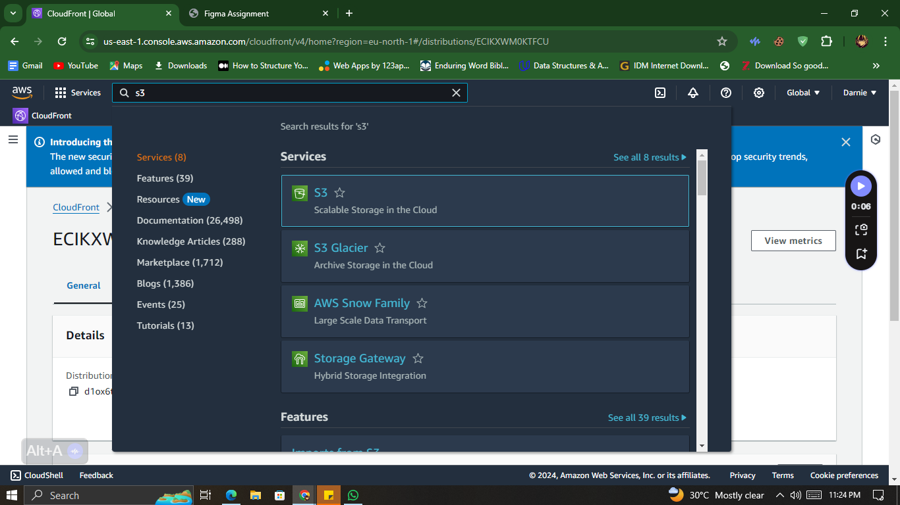
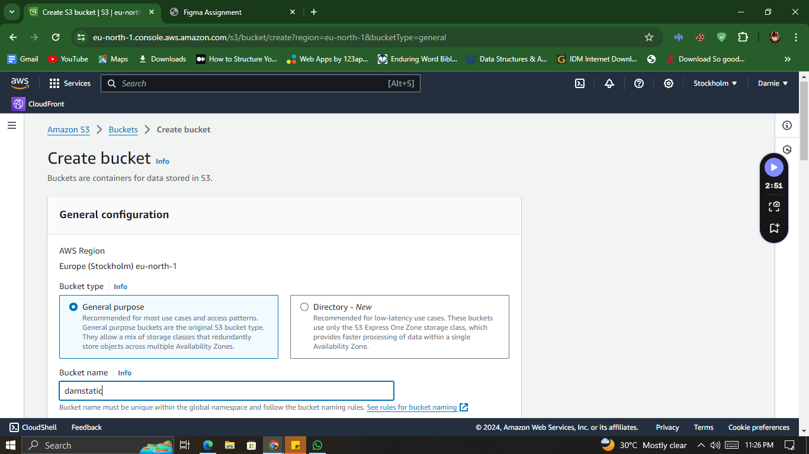
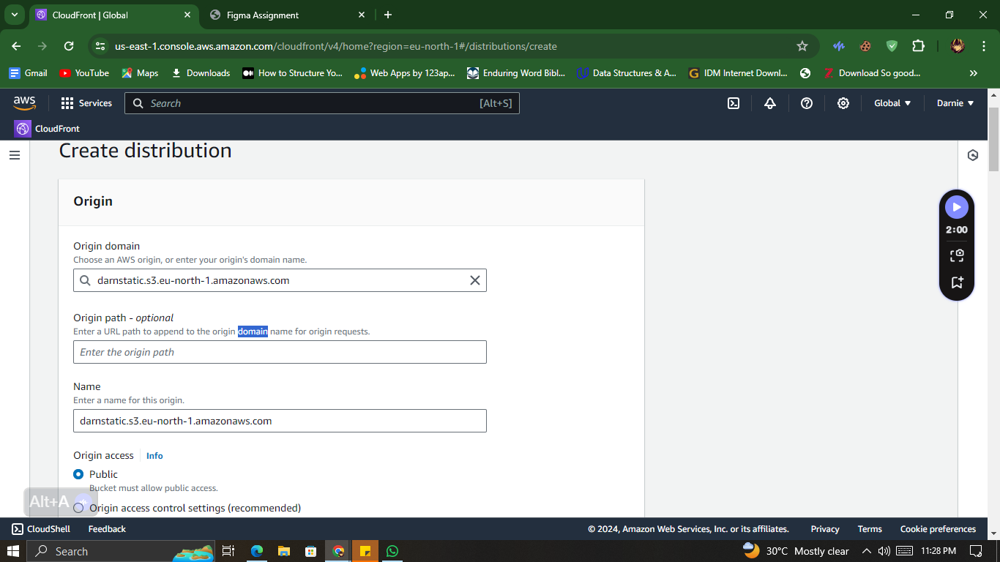
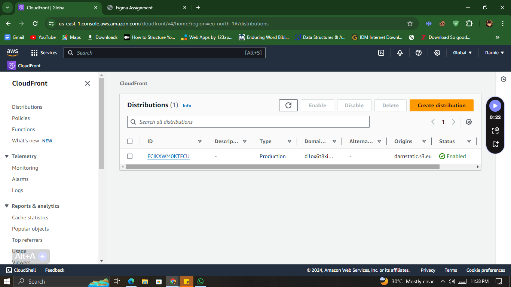
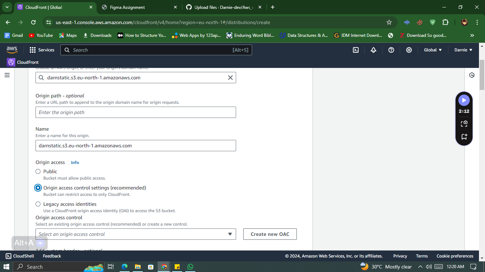
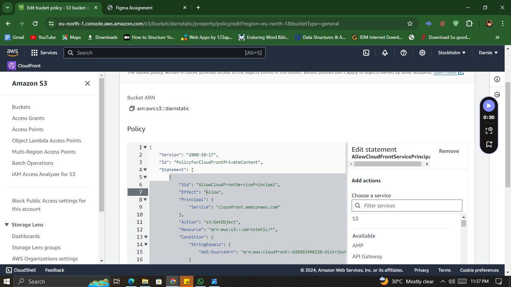
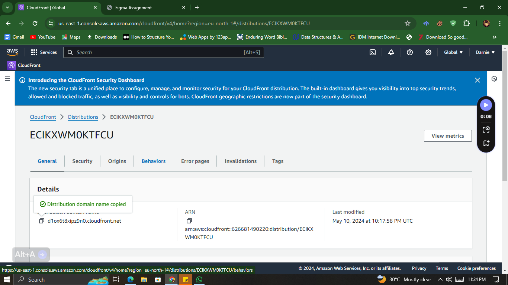
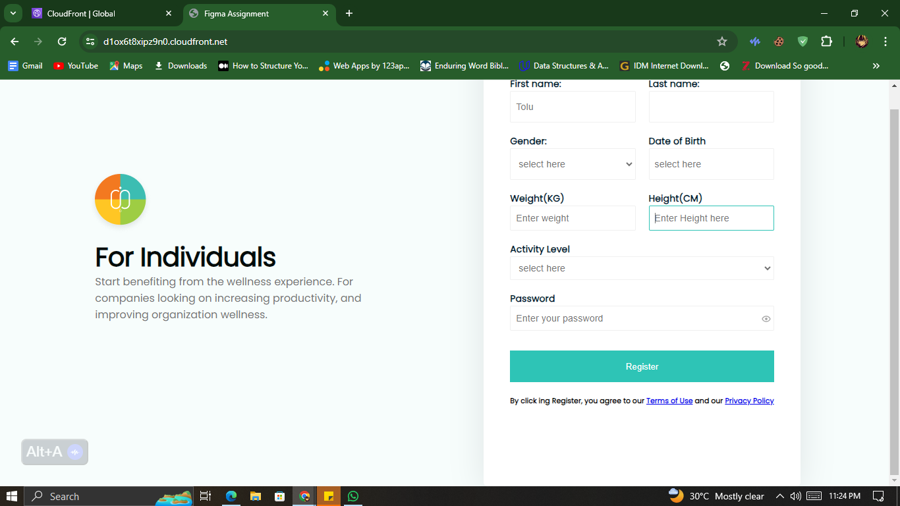

# Aws_static_page
This project involves deploying a static website using AWS S3 Bucket for storage and CloudFront for content delivery. Here are the steps:

1. **S3 Bucket Creation**: 
   - Create an S3 bucket to store the static website files.
     
     
 
2. **Static Website Upload**:
   - Upload the static website files to the created S3 bucket.
     
      
3. **CloudFront Distribution Creation**:
   - Set up a CloudFront distribution to serve the static website content.
     
     

4. **Origin Access Control (OAC)**:
   - Implement Origin Access Control to restrict access to the public.
   

5. **Public Policy Addition**:
   - Add a policy to make the static website content publicly accessible.
   
6. **Website Confirmation**:
   - Confirm the deployment by accessing the website using the CloudFront distribution domain name.
   
   

END
